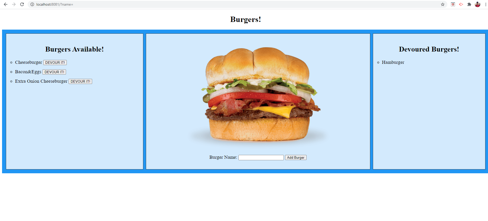

# Burger (Node Express Handlebars)

## Description :octocat:

This app demonstrates the use of express handlebars framework to develop a web application. The MVC (Model/View/Controller) were also applied in this project. 
A customized ORM (Object-Relational Mapping) were created, instead of using a thirt-party module, such as sequelize.

[Deployed App at Heroku](https://burger-correaph.herokuapp.com/

[My GitHub Profile](https://github.com/correaph)

## Table of Contents

* [Installation](#installation)

* [License](#license)

* [Contributing](#contributing)

* [Test](#test)

* [Questions](#questions)

## Installation

Open git bash, or terminal, and clone the git repo in a new local folder. Run npm install, to get all the dependencies. 
Run the 'db\schema.sql' in MySQL to create the database and tables. You can also run 'seed.sql' to add some initial records to the tables.

## Usage

Open terminal, and type 'node server' and wait for a message showing the server is listening. Open the web browser and type localhost:8081.

## License

Free

## Contributing

Send me an email if you have ideas on how to make this app better. 
<henriqueph@hotmail.com>

## Test

No test cases were created, but you can simply manipulate some data via app, and check directly on the database.

## Questions

Is it easy to reuse this project to build a MVM project ? Yes, you just need a few adjustments on the code.
